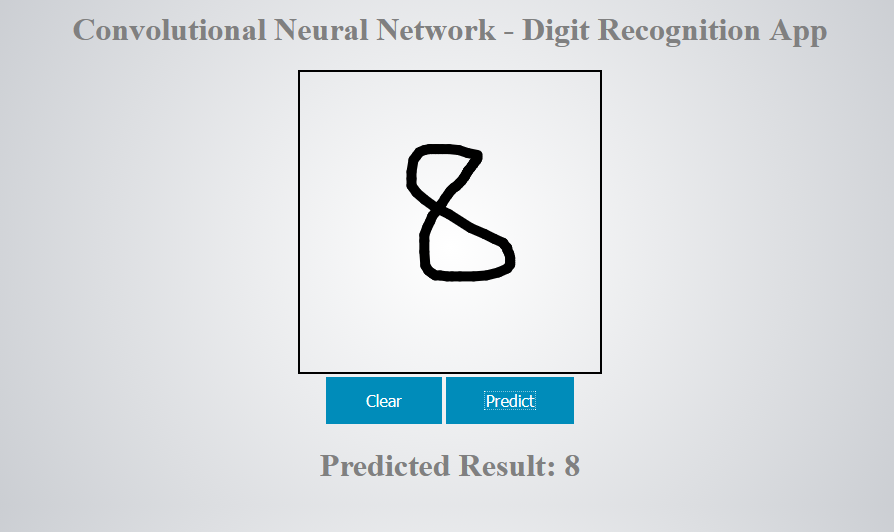

# CNN-Digit-Classification-App
<h3>A webapp made via Flask, Python, and JS which classifies digits (0-9) via a Trained CNN model<h3>

The model was a fairly simple implementation trained on the Mnist dataset (the weights can be found in the model_weights folder)

Requirements:
* Tensorflow
* Keras
* Flask
* Python

*I had a lot of fun building this app. For anyone interested in Computer Vision based Machine Learning, I highly recommend this as an excercise!* Credits to Syed Moinudeen for the wonderful idea/concept!
